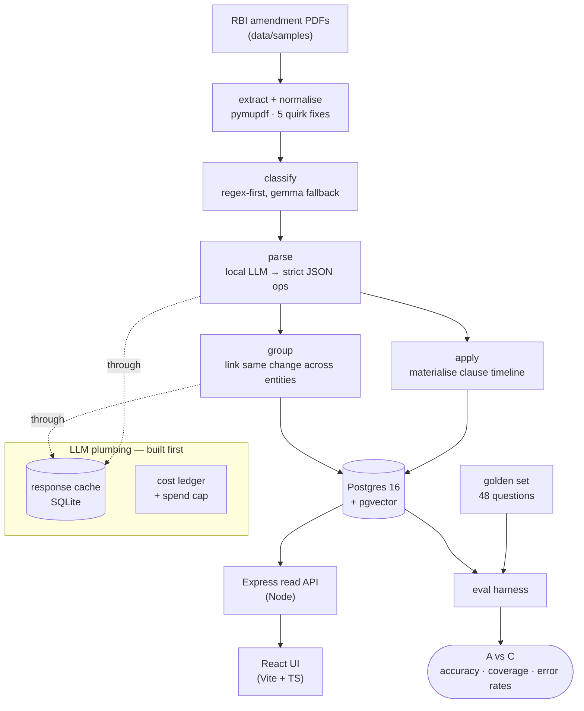

# RBI Regulatory Timeline Engine

Answers one question that generic RAG gets **confidently wrong**:

> **For a given type of regulated entity, on a given date, what does clause X actually say?**

The system filters on **entity type** and **temporal validity** *before* it does anything
semantic. Semantic similarity narrows within an already-correct slice; it never selects the
slice. When nothing fits, the system **abstains** instead of guessing.

## ▶ Live demo — [shreyasnaik0101.github.io/Vidhi](https://shreyasnaik0101.github.io/Vidhi/)

No setup; runs entirely in the browser. Ask a question in plain English, drag a date across the
moment a rule comes into force, and see the same question answered by normal AI search vs. this
system side by side. The hosted demo serves every read feature from a dataset **exported out of
the running system**, with the resolver and question-parsing logic running client-side; the *Add a
document* tab **replays a recorded run** of the live ingestion pipeline. The full stack — local
models, Postgres, and live ingestion — runs with the [Quick start](#quick-start) below.

---

## Why this exists

On 28 Nov 2025 the RBI consolidated 9,445 circulars into 244 entity-specific Master Directions.
Amendments issued *after* that land the **same policy at different coordinates** for different
entities — and take effect on a later date than they're published. Two real amendments (both
16 Jul 2026, both in `data/samples/`) drive the design:

| | Regional Rural Banks | Local Area Banks |
|---|---|---|
| Amendment | RBI/2026-27/201 | RBI/2026-27/202 |
| Clauses added | `68C`, `68D` | `119C`, `119D` |
| The text | "…acquisition of **a Specified Non-Financial Asset (SNFA)**,…" | "…acquisition of **an SNFA**,…" |
| Issued → Effective | 16 Jul 2026 → **1 Oct 2026** | 16 Jul 2026 → **1 Oct 2026** |

Same policy, **95.7% identical text**, different clause numbers, and *not in force for 2.5 months
after publication*. Exact matching says "different"; embeddings say "same" without explaining why;
neither knows *who is asking* or *when*.

## The result

Baseline A (naive RAG — one index, nearest chunk) vs Baseline C (this system), on a hand-labelled
**48-question golden set** (`make eval`):

| Metric | A · naive RAG | C · full system |
|---|---:|---:|
| Overall accuracy | 4.2% | **68.8%** |
| Coverage (answered / answerable) | 100% | 50% |
| **Entity error rate** | **47.9%** | **0.0%** |
| **Temporal error rate** | **16.7%** | **0.0%** |

Naive RAG answers *everything* and returns **the wrong entity's clause ~half the time** and
not-yet-in-force text 17% of the time — it cannot abstain. The full system makes **neither error**.
(100% coverage at 4% accuracy is exactly why coverage must be read *alongside* accuracy.)

---

## Architecture



The **query that defines the product** applies the entity + validity filter first, then reuses one
tested resolver for the temporal decision (`in_force` / `not_yet_in_force` / `no_longer_in_force` /
`no_provision`):

```sql
SELECT text, valid_from, valid_to FROM clause
WHERE md_family = :family AND entity_type_id = :entity AND clause_number = :clause
  AND valid_from <= :as_of AND (valid_to IS NULL OR valid_to > :as_of);
```

## Pipeline

| # | Stage | Tool | LLM |
|---|---|---|---|
| 1 | fetch | requests + BeautifulSoup | — *(not built; corpus is the 2 samples)* |
| 2–3 | extract / normalise | pymupdf | — |
| 4 | classify | regex-first, gemma fallback | local |
| 5 | parse | local model, grammar-constrained JSON | local |
| 6 | verify | Bedrock | *(not built — the one paid step)* |
| 7 | apply | python | — |
| 8 | group | embeddings + similarity | local |

The parser emits **structure only** (operation, chapter, clause numbers, a short *verbatim*
evidence span); the clause body is sliced from source deterministically, so it is verbatim by
construction. Evidence spans are validated by substring check — a cheap hallucination guard.
`unresolved` is a first-class output: the system is built to say "I can't resolve this".

## Stack

- **Pipeline & domain logic:** Python 3.11 (pymupdf, psycopg, pydantic, typer)
- **Local models via Ollama:** `gemma4:latest` for parse/classify, `nomic-embed-text-v2-moe` for
  embeddings. *(The original brief named `qwen3:8b` / `gemma3:4b`; those weren't pulled on this
  machine, so the model is configurable and set to what's available.)*
- **Store:** Postgres 16 + pgvector in Docker (never RDS — cost control is a functional requirement)
- **API:** Node + Express (`api/`) — *chosen over the brief's FastAPI by preference; the pipeline
  stays in Python and fills the DB, the API only reads, and the as-of resolver is ported to JS with
  its own tests so both agree.* See `PROJECT_SPEC.md §10`.
- **UI:** React + Vite + TypeScript (`ui/`) — 4 screens, time as the spatial spine

## Quick start

```bash
# 0. prerequisites: Docker Desktop running; Ollama with the two models pulled
ollama pull gemma4:latest
ollama pull nomic-embed-text-v2-moe

# 1. database + Python pipeline
make install
make db-up            # Postgres + pgvector on :5433 (schema + 11 entity seeds auto-load)
make db-sync          # extract → classify → parse → apply → group → persist
make eval-index       # build the naive-RAG pgvector index

# 2. API + UI
make api-install && make api-dev            # Express on :3001
cd ui && npm install && npm run dev         # Vite on :5173  → open it

# measurement
make eval             # Baseline A (naive RAG) vs C (full system)
make cost             # LLM spend by stage / model (enforced under $20)
make test             # 110 Python tests
```

## The three demos (definition of done)

1. **The date flip** — as-of explorer, same entity + clause, drag the date across 1 Oct 2026:
   `not_yet_in_force` → `in_force`, the text appears.
2. **The comparison** — "Naive RAG vs full" screen: naive returns LAB's clause for an RRB question;
   the full system returns the right one and labels the error.
3. **The abstention** — a live case where the system says "no provision / not yet in force", shows
   the candidates it considered, and refuses to guess.

## Testing

110 Python tests (`make test`) + 7 JS resolver tests (`make api-test`). Each extraction quirk, the
LLM spend cap, the parser's hallucination guards, the timeline overlap invariant, and the golden
labels (cross-checked against the resolver) are covered. Integration tests skip cleanly when
Postgres or Ollama is unavailable.

## Honest limitations

- **Corpus is 2 documents** (RRB, LAB). SFB / cascade golden questions are genuine *coverage* gaps,
  not accuracy failures — the system correctly abstains on entities it hasn't ingested. The `fetch`
  stage (live RBI scraping) is not built.
- **The `verify` stage (Bedrock) is not built** — it's the one paid step and needs AWS credentials.
  So the accuracy-vs-cost table's *cost* column is $0 (everything runs on cached local models); the
  cost dimension becomes meaningful once the verifier is wired.
- **Baseline B** (filtered retrieval, no LLM) is not built — the sweep is A vs C.
- **Test isolation:** the DB integration tests repopulate the dev database with fixtures. After
  `make test`, restore real data with `make db-sync && make eval-index`. A dedicated test database
  is the proper fix.
- **AWS/CDK infra** (S3, Lambda, Step Functions) from the brief is not built.

See `PROJECT_SPEC.md` for the full project brief and design rationale.
